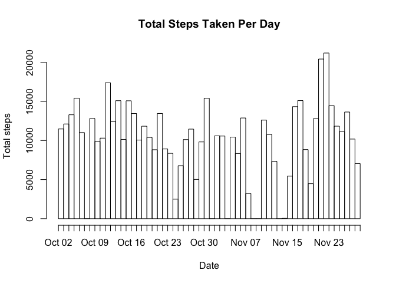
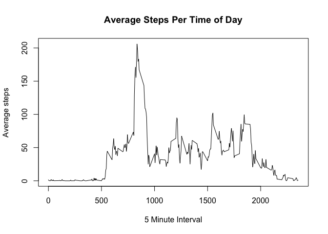
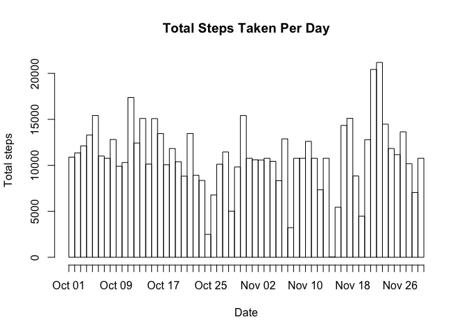
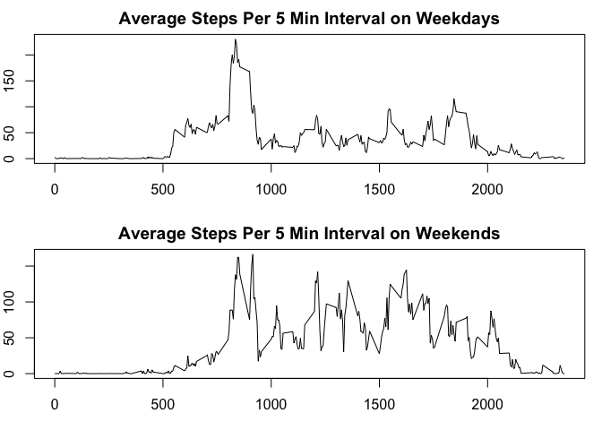

## 1. Code for reading in the dataset and/or processing the data:


```r
activity <- tbl_df(read.csv('/Users/NatashaNicholson/Documents/R/reproducible research/activity.csv'))
activity$date <- as.Date(activity$date)
total_steps <- activity %>% group_by(date) %>% summarise(steps_per_day=sum(steps))
total_steps <- na.omit(total_steps)
```

## 2. Histogram of the total number of steps taken each day:


```r
hist <- hist(rep(total_steps$date, total_steps$steps_per_day), freq=TRUE, breaks = "days",
             xlab='Date', ylab='Total steps', main='Total Steps Taken Per Day')
```

<!-- -->

## 3. Mean and median number of steps taken each day:


```r
mean <- mean(total_steps$steps_per_day)
median <- median(total_steps$steps_per_day)
```

Mean = 1.0766189
Median = 10765  

## 4. Time series plot of the average number of steps taken:


```r
day_average <- activity %>% group_by(interval) %>% summarise(avg=mean(steps, na.rm=TRUE))
day_average$interval <- day_average$interval %>% str_pad(width=4, side='left', pad='0')
time <- plot(day_average, type='l', xlab='5 Minute Interval', ylab='Average steps', 
             main='Average Steps Per Time of Day')
```

<!-- -->

## 5. The 5-minute interval that, on average, contains the maximum number of steps:


```r
max_steps = filter(day_average, avg==max(day_average$avg))
max_steps_interval <- max_steps$interval
```

Max steps 5-min interval = 0835

## 6. Code to describe and show a strategy for inputing missing data. Code replaces nas with average for that time interval:


```r
nas <- count(filter(activity, is.na(steps)))
activity_na <- activity
activity_na["interval"] = str_pad(activity_na$interval, width=4, side='left', pad='0')
activity_na <- left_join(activity_na, day_average, by="interval") %>% 
  mutate(steps = ifelse(is.na(steps), avg, steps))
activity_complete <- select(activity_na, steps, date, interval)
```

## 7. Histogram of the total number of steps taken each day after missing values are imputed


```r
comp_total_steps <- activity_complete %>% group_by(date) %>% summarise(steps_per_day=sum(steps))
complete_hist <- hist(rep(comp_total_steps$date, comp_total_steps$steps_per_day), freq=TRUE, breaks = "days",
             xlab='Date', ylab='Total steps', main='Total Steps Taken Per Day')
```

<!-- -->

```r
comp_mean <- mean(comp_total_steps$steps_per_day)
comp_median <- median(comp_total_steps$steps_per_day)
```

Mean from complete data = 1.0766189
Median from complete data = 1.0766189

## 8. Panel plot comparing the average number of steps taken per 5-minute interval across weekdays and weekends


```r
activity_complete["day"] = weekdays(activity_complete$date)
wd = factor(c('weekday', 'weekend'))
activity_complete <- mutate(activity_complete, day = ifelse(grepl("Saturday", day)|grepl("Sunday", day), levels(wd)[2], levels(wd)[1]))
par(mar=c(3,2,2,1))
par(mfrow=c(2,1))
weekday_intervals <- filter(activity_complete, day=='weekday') %>% group_by(interval) %>% summarise(avg=mean(steps))
weekend_intervals <- filter(activity_complete, day=='weekend') %>% group_by(interval) %>% summarise(avg=mean(steps))
weekday_plot <- plot(weekday_intervals, type='l', xlab='5 minute interval', ylab='Average steps', 
                     main='Average Steps Per 5 Min Interval on Weekdays')
weekend_plot <- plot(weekend_intervals, type='l', xlab='5 minute interval', ylab='Average steps', 
                     main='Average Steps Per 5 Min Interval on Weekends')
```

<!-- -->
